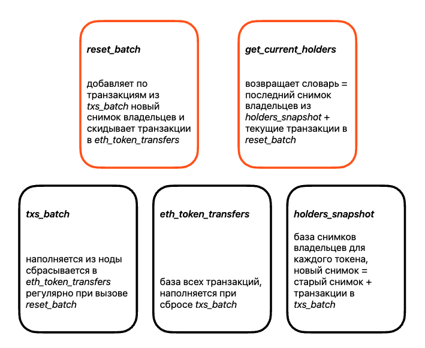

## Лямбда подход для анализа списка держателей токенов

### Архитектура
1. Батч сырых транзакций `txs_batch`. Обновляется из ноды, периодически сбрасывается скриптом `reset_batch.py` в базу всех транзакций `eth_token_transfers`. Тем же скриптом в базу `holders_snapshot` добавляется новая запись с текущим списком держателей токенов.
2. Для оперативного получения списка держаталей токенов скрипт `get_current_holders.py` берет последнюю запись из `holders_snapshot` и добавляет к ней транзакции из `txs_batch`.

Картинка с описанием структуры:


Вид записей в базе `holders_snapshot`:
```
{
    "_id_": ObjectId(),
    "datetime": DateTime(),
    "data": {
        "<token_id>": {
            "<address>": <balance>,
            "<address>": <balance>,
            ...
        },
    }
}
```
